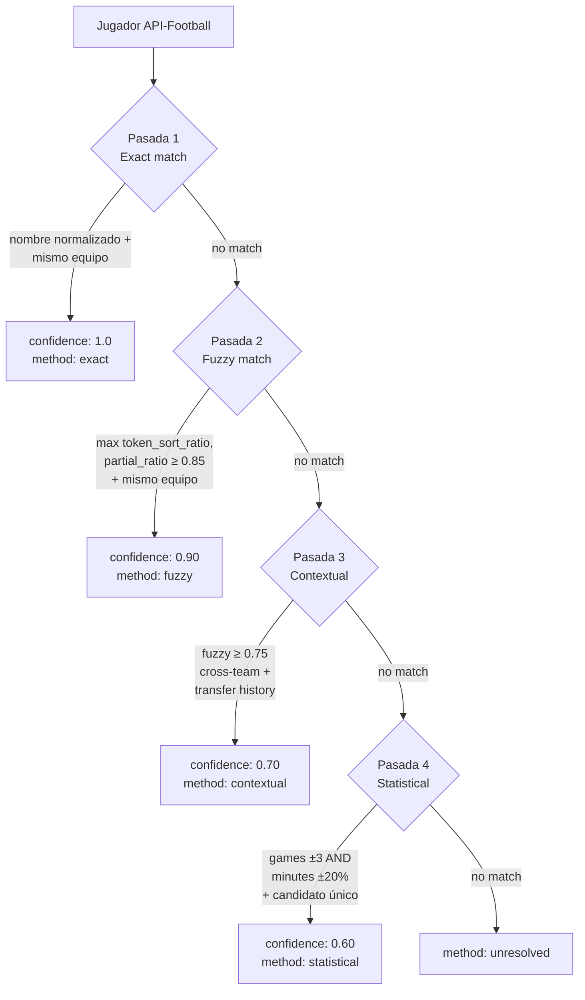

# Football Data Pipeline


Pipeline de datos multi-fuente para football analytics. Integra **API-Football** y **Understat**, resuelve la incompatibilidad de IDs entre ambas fuentes mediante entity resolution de 4 pasadas, y sirve datos enriquecidos a través de Datasette. Orquestado con Airflow 3.x, containerizado con Podman.

**Scope actual:** La Liga 2024/25, una sola temporada. El config permite expandir a cualquier liga y temporada editando tres líneas en `config/ingestion.yaml`.

---

## Tabla de contenidos

- [Football Data Pipeline](#football-data-pipeline)
  - [Tabla de contenidos](#tabla-de-contenidos)
  - [Problema: IDs incompatibles entre fuentes](#problema-ids-incompatibles-entre-fuentes)
    - [Por qué estas dos fuentes](#por-qué-estas-dos-fuentes)
  - [Arquitectura de 4 capas](#arquitectura-de-4-capas)
    - [Flujo de datos](#flujo-de-datos)
  - [Quick start](#quick-start)
    - [Requisitos](#requisitos)
    - [1. Configurar el entorno](#1-configurar-el-entorno)
    - [2. Levantar el stack](#2-levantar-el-stack)
    - [3. Ejecutar el pipeline](#3-ejecutar-el-pipeline)
  - [Limitaciones del free tier de API-Football](#limitaciones-del-free-tier-de-api-football)
  - [Capas del pipeline](#capas-del-pipeline)
    - [RAW — Parquet + JSON cache](#raw--parquet--json-cache)
    - [CLEAN — PostgreSQL 18](#clean--postgresql-18)
    - [FEATURES — Parquet](#features--parquet)
    - [ENRICHED — SQLite + Datasette](#enriched--sqlite--datasette)
  - [Entity resolution](#entity-resolution)
    - [El problema](#el-problema)
    - [Estrategia: resolución de equipos primero](#estrategia-resolución-de-equipos-primero)
    - [4 pasadas de resolución](#4-pasadas-de-resolución)
  - [API-Football: rate limiting y cache](#api-football-rate-limiting-y-cache)
    - [Estrategia cache-first](#estrategia-cache-first)
    - [Estrategia per-team para jugadores](#estrategia-per-team-para-jugadores)
    - [Presupuesto de calls — La Liga 2024/25](#presupuesto-de-calls--la-liga-202425)
    - [Cambiar de liga](#cambiar-de-liga)
  - [Capa ENRICHED: Datasette](#capa-enriched-datasette)
  - [Desarrollo y tests](#desarrollo-y-tests)
    - [Makefile](#makefile)
    - [Comandos manuales (sin Make)](#comandos-manuales-sin-make)
    - [Estructura del repositorio](#estructura-del-repositorio)
  - [Decisiones de arquitectura (ADRs)](#decisiones-de-arquitectura-adrs)
  - [Estado de implementación](#estado-de-implementación)
  - [Cumplimiento de TOS](#cumplimiento-de-tos)

---

## Problema: IDs incompatibles entre fuentes

Las dos fuentes del pipeline asignan IDs propios a los mismos jugadores y no existe ningún identificador compartido:

| Fuente       | ID del jugador    | Nombre almacenado      |
| ------------ | ----------------- | ---------------------- |
| API-Football | `player_id: 1100` | "Pedro González López" |
| Understat    | `player_id: 8872` | "Pedri"                |

Adicionalmente, Understat no expone `birth_date` ni `nationality`, lo que elimina los señales de deduplicación más habituales. La **entity resolution** es el problema central del pipeline: sin ella, los datos de rendimiento agregado (API-Football) y las métricas avanzadas xG (Understat) no se pueden cruzar por jugador.

### Por qué estas dos fuentes

- **API-Football** — Stats agregadas de temporada, lesiones, transferencias, imágenes de jugador. Acceso legítimo vía API key con free tier de 100 calls/día.
- **Understat** — Métricas avanzadas (xG, xA, npxG, xGChain, xGBuildup) y datos shot-level con coordenadas. Fuente única para estas métricas; scraping educativo aceptable.

**FBref fue descartado** ([ADR-002](docs/adr/002-data-source-selection.md)): tras la retirada de métricas Opta por parte de FBref en enero 2026, sus datos quedan reducidos a stats básicas agregadas que API-Football ya cubre con mayor fiabilidad de acceso.

---

## Arquitectura de 4 capas

```mermaid
flowchart LR
    subgraph Fuentes
        AF[API-Football\nREST API]
        US[Understat\nScraping]
    end

    subgraph RAW["RAW — Parquet"]
        R1[api_football/\nplayers · injuries · transfers]
        R2[understat/\nshots · player_season]
        RC[cache/api_football/\nJSON crudo]
    end

    subgraph CLEAN["CLEAN — PostgreSQL 18"]
        C1[teams]
        C2[players\nresolution_confidence]
        C3[player_season_stats]
        C4[player_season_advanced]
        C5[player_shots]
        C6[player_profile]
        C7[player_injuries]
        C8[player_transfers]
    end

    subgraph FEATURES["FEATURES — Parquet"]
        F1[per-90 metrics]
        F2[xG overperformance]
        F3[percentiles]
        F4[injury features]
    end

    subgraph ENRICHED["ENRICHED — SQLite / Datasette"]
        E1[player_season_stats_flat\nvista desnormalizada]
    end

    AF -->|httpx + cache| R1
    AF -->|cache JSON| RC
    US -->|soccerdata| R2

    R1 -->|Pydantic v2\nvalidation| CLEAN
    R2 -->|Entity resolution\nrapidfuzz| CLEAN

    CLEAN -->|feature_engineering.py| FEATURES
    FEATURES -->|export| ENRICHED
```



### Flujo de datos

1. **RAW**: los datos llegan tal cual de cada fuente y se persisten en Parquet. API-Football también cachea JSON crudo por endpoint y hash de parámetros.
2. **CLEAN**: transformación y normalización. La entity resolution cruza IDs entre fuentes y almacena el resultado en PostgreSQL con `resolution_confidence` y `resolution_method`.
3. **FEATURES**: métricas derivadas calculadas sobre CLEAN — per-90, xG overperformance, xGChain/xGBuildup per-90, percentiles, features de lesión/transferencia.
4. **ENRICHED**: vista plana `player_season_stats_flat` exportada a SQLite y servida por Datasette con imágenes de jugador.

---

## Quick start

### Requisitos

- [Podman](https://podman.io/) y `podman-compose` (o Docker + `docker compose`)
- [uv](https://docs.astral.sh/uv/) para gestión de dependencias Python
- `make` (GNU Make, incluido en Linux/macOS; en Windows usar WSL o Git Bash)
- **API key de [API-Football](https://www.api-football.com)** — obligatoria, ver [limitaciones del free tier](#limitaciones-del-free-tier-de-api-football)

### 1. Configurar el entorno

```bash
make init
```

`make init` configura el `.env` de forma interactiva: genera automáticamente las claves de seguridad (Fernet key, JWT secret, API secret) y solicita la `API_FOOTBALL_KEY`. Es el método recomendado frente a editar `.env` a mano.

### 2. Levantar el stack

```bash
make up
```

Arranca 5 servicios en segundo plano: PostgreSQL 18, Airflow webserver, Airflow scheduler, Airflow DAG processor y Datasette. La salida confirma las URLs:

```
✓  Stack levantado
   Airflow UI  →  http://localhost:8080  (admin / admin)
   Datasette   →  http://localhost:8001
   PostgreSQL  →  localhost:5432  (airflow / airflow)
```

### 3. Ejecutar el pipeline

```bash
make pipeline-full
```

Dispara las dos ingestas en paralelo y muestra los pasos siguientes en orden. Cuando cada DAG finalice en la UI de Airflow (`http://localhost:8080`), ejecutar el siguiente paso:

| Paso | Comando                  | DAG disparado                   | Descripción                           |
| ---- | ------------------------ | ------------------------------- | ------------------------------------- |
| 1    | `make pipeline-full`     | ingest_api_football + understat | Ingesta paralela de ambas fuentes     |
| 2    | `make pipeline-clean`    | transform_clean                 | RAW → CLEAN con entity resolution     |
| 3    | `make pipeline-features` | build_features                  | CLEAN → FEATURES (skeleton)           |
| 4    | `make pipeline-enrich`   | export_enriched                 | FEATURES → ENRICHED SQLite (skeleton) |

Datasette disponible en `http://localhost:8001` tras completar el paso 4.

> **Sin Make:** ver la sección [Comandos manuales](#comandos-manuales-sin-make) al final del documento.

---

## Limitaciones del free tier de API-Football

La API key de API-Football es **obligatoria** — el pipeline no funciona sin ella. El [free tier](https://www.api-football.com/pricing) tiene tres limitaciones relevantes:

| Limitación             | Free tier          | Impacto en el pipeline                                     |
| ---------------------- | ------------------ | ---------------------------------------------------------- |
| Calls por día          | 100                | La Liga completa usa ~63 calls; margen de ~37 para debug   |
| Paginación máxima      | Página 3 por query | Se resuelve con estrategia per-team (ver sección de cache) |
| Temporadas disponibles | 2022/23 – 2024/25  | El config usa 2024/25 para maximizar cobertura disponible  |

**Por qué el proyecto usa La Liga 2024/25:** es la temporada más reciente disponible en el free tier y la que permite probar el pipeline completo sin coste. La restricción de temporadas hace que no sea posible usar el free tier con temporadas anteriores a 2022/23 ni con la 2025/26 hasta que esté disponible.

Para uso en producción, temporadas fuera de ese rango, o ligas con más de ~250 jugadores activos, se recomienda contratar un [plan de pago](https://www.api-football.com/pricing) de API-Football.

---

## Capas del pipeline

### RAW — Parquet + JSON cache

```text
data/
├── cache/api_football/          # JSON crudo por endpoint (git-ignored)
│   ├── teams/
│   ├── players/
│   ├── injuries/
│   └── transfers/
└── raw/                         # Parquet validado con Pydantic v2 (git-ignored)
    ├── api_football/
    │   ├── players.parquet
    │   ├── injuries.parquet
    │   └── transfers.parquet
    └── understat/
        ├── shots.parquet
        └── player_season.parquet
```

Cada registro pasa por validación Pydantic v2 antes de escribirse. Los registros inválidos se loguean como `WARNING` y se cuentan como "rechazados" — el DAG nunca crashea por un registro individual.

### CLEAN — PostgreSQL 18

8 tablas centradas en el jugador. La resolución de identidad ocurre en esta capa:

| Tabla                    | Fuente        | Descripción                                                                                        |
| ------------------------ | ------------- | -------------------------------------------------------------------------------------------------- |
| `teams`                  | API-Football  | IDs de las 2 fuentes + metadata de resolución                                                      |
| `players`                | Ambas fuentes | canonical_name, IDs cruzados, `resolution_confidence`, `resolution_method`, `resolution_timestamp` |
| `player_season_stats`    | API-Football  | appearances, minutes, goals, assists, shots, tackles, cards                                        |
| `player_season_advanced` | Understat     | xG, xA, npxG, xGChain, xGBuildup, key_passes                                                       |
| `player_shots`           | Understat     | coordenadas x/y, xG, resultado, body_part, situation                                               |
| `player_profile`         | API-Football  | height, weight, foot, position, contract                                                           |
| `player_injuries`        | API-Football  | tipo lesión, fechas, equipo                                                                        |
| `player_transfers`       | API-Football  | from/to team, fecha, tipo (loan/permanent/free), fee                                               |

El DDL completo está en `config/sql/init.sql`.

### FEATURES — Parquet

Métricas derivadas calculadas sobre CLEAN: per-90 normalizados, xG overperformance (goals - xG), xGChain y xGBuildup per-90, percentiles de liga, y features de disponibilidad (días de lesión, número de transferencias). Formato Parquet en `data/features/`.

### ENRICHED — SQLite + Datasette

Vista desnormalizada `player_season_stats_flat` que une todas las métricas por jugador en una sola fila, incluyendo la URL de imagen de jugador servida por API-Football. Exportada a `data/enriched/enriched.db` y servida por Datasette en el puerto 8001.

---

## Entity resolution

### El problema

Understat no expone `birth_date` ni `nationality`. Las dos fuentes usan IDs propios sin ningún campo de cruce estándar. El equipo al que pertenece el jugador es la señal de deduplicación más fiable disponible.

### Estrategia: resolución de equipos primero

La resolución de equipos se ejecuta antes que la de jugadores. Los nombres de equipos son más estables y cortos que los de jugadores, lo que permite un fuzzy matching más preciso. El equipo resuelto se usa como contexto reductor en las 4 pasadas de resolución de jugadores.

### 4 pasadas de resolución



| Pasada          | Criterio                                                       | Confidence |
| --------------- | -------------------------------------------------------------- | ---------- |
| 1 — Exact       | Nombre normalizado (multi-variant) + mismo equipo resuelto     | 1.0        |
| 2 — Fuzzy       | `max(token_sort_ratio, partial_ratio)` ≥ 0.85 + mismo equipo   | 0.90       |
| 3 — Contextual  | Fuzzy ≥ 0.75 cross-team + historial de transferencias confirma | 0.70       |
| 4 — Statistical | Games ±3 AND minutes ±20% + mismo equipo + candidato único     | 0.60       |

**Objetivo de precisión:** ≥ 18 de 20 jugadores conocidos resueltos correctamente (test en `tests/test_entity_resolution.py`).

La resolución genera un informe CSV con todos los matches, confidence scores y método utilizado, útil para auditar casos límite.

---

## API-Football: rate limiting y cache

### Estrategia cache-first

Cada llamada a la API verifica primero si existe una respuesta cacheada:

```text
data/cache/api_football/
├── teams/
│   └── league_140_season_2024.json
├── players/
│   ├── league_140_season_2024_team_529_page_1.json
│   └── league_140_season_2024_team_541_page_1.json
├── injuries/
│   └── league_140_season_2024.json
└── transfers/
    ├── team_529.json
    └── team_541.json
```

- **TTL**: 168 horas (7 días) en producción, configurable en `config/ingestion.yaml`.
- **`force_refresh`**: parámetro del loader para forzar actualización ignorando cache.
- El loader expone métricas de logging: calls realizadas, calls desde cache, calls restantes.

### Estrategia per-team para jugadores

El free tier limita la paginación a un máximo de página 3 por query. Usando `/players?league=140` se accede a un máximo de 60 jugadores — insuficiente para una liga completa (~500-700 jugadores).

**Solución implementada:** consulta por equipo (`/players?team={id}&season=2024`). Cada equipo tiene 25-35 jugadores, caben en 1-2 páginas. El límite de 3 páginas aplica por query, no globalmente.

### Presupuesto de calls — La Liga 2024/25

| Endpoint                                      | Calls estimadas | Notas                              |
| --------------------------------------------- | --------------- | ---------------------------------- |
| `/teams?league=140&season=2024`               | 1               | Descubrimiento de team_ids         |
| `/players?team={id}&season=2024` × 20 equipos | ~40             | ~2 páginas por equipo              |
| `/injuries?league=140&season=2024`            | ~1              | Sin paginación                     |
| `/transfers?team={id}` × 20 equipos           | ~20             | 1 call por equipo                  |
| `/standings?league=140&season=2024`           | 1               |                                    |
| **Total estimado**                            | **~63**         | Margen de ~37 calls para debugging |

### Cambiar de liga

Editar `config/ingestion.yaml`:

```yaml
sources:
  api_football:
    league_id: 39 # Premier League
    season: 2024
  understat:
    league: "EPL" # soccerdata format
    season: "2024/2025"
```

---

## Capa ENRICHED: Datasette

Datasette sirve la vista `player_season_stats_flat` en `http://localhost:8001`. Esta vista desnormalizada combina en una sola fila por jugador y equipo:

- Stats observables de temporada (goals, assists, minutes, cards)
- Métricas avanzadas Understat (xG, xA, npxG, xGChain, xGBuildup)
- Features calculadas (per-90, percentiles de liga, xG overperformance)
- Metadata de scouting (posición, pie dominante, fecha de nacimiento)
- Imagen del jugador renderizada vía el plugin `datasette-render-image-tags`

Los plugins activos son `datasette-vega` (visualizaciones) y `datasette-render-image-tags` (imágenes de jugador desde URL de API-Football). La configuración de metadata y assets estáticos se encuentra en `config/datasette/`.

---

## Desarrollo y tests

### Makefile

El Makefile cubre el ciclo de vida completo. Auto-detecta Podman o Docker y colorea la salida. Ejecutar `make` sin argumentos muestra la ayuda completa.

**Entorno y stack:**

| Comando          | Descripción                                                         |
| ---------------- | ------------------------------------------------------------------- |
| `make init`      | Genera `.env` con claves de seguridad y solicita `API_FOOTBALL_KEY` |
| `make env-check` | Verifica que `.env` existe y la API key está configurada            |
| `make up`        | Levanta el stack completo en segundo plano                          |
| `make down`      | Para y elimina contenedores (conserva volúmenes)                    |
| `make ps`        | Estado de los servicios                                             |
| `make logs`      | Logs en tiempo real (`SERVICE=airflow-scheduler` para filtrar)      |
| `make shell`     | Abre bash en el contenedor del scheduler                            |

**Pipeline:**

| Comando                    | Descripción                                         |
| -------------------------- | --------------------------------------------------- |
| `make pipeline-full`       | Dispara ingesta paralela + muestra pasos siguientes |
| `make pipeline-clean`      | RAW → CLEAN (entity resolution + PostgreSQL)        |
| `make pipeline-features`   | CLEAN → FEATURES                                    |
| `make pipeline-enrich`     | FEATURES → ENRICHED SQLite                          |
| `make dag-run DAG=<id>`    | Dispara cualquier DAG por nombre                    |
| `make dag-status DAG=<id>` | Últimas 5 ejecuciones de un DAG                     |

**Calidad de código:**

| Comando          | Descripción                                     |
| ---------------- | ----------------------------------------------- |
| `make install`   | `uv sync --all-extras`                          |
| `make test`      | `pytest tests/ -v`                              |
| `make lint`      | `ruff check` (sin modificar)                    |
| `make lint-fix`  | `ruff check --fix`                              |
| `make format`    | `ruff format`                                   |
| `make typecheck` | `mypy src/pipeline/`                            |
| `make check`     | lint + format-check + typecheck simultáneamente |

**Cache y backups:**

| Comando                                      | Descripción                                   |
| -------------------------------------------- | --------------------------------------------- |
| `make cache-stats`                           | Tamaño y número de archivos por endpoint      |
| `make cache-clear`                           | Borra toda la caché (pide confirmación)       |
| `make cache-clear-endpoint ENDPOINT=players` | Borra la caché de un endpoint concreto        |
| `make backup`                                | Dump PostgreSQL + compresión de datos locales |
| `make db-shell`                              | Sesión psql en la base de datos `football`    |
| `make db-reset`                              | Destruye y recrea PostgreSQL desde cero       |

### Comandos manuales (sin Make)

Para entornos sin Make disponible:

```bash
# Setup
cp .env.example .env          # editar API_FOOTBALL_KEY manualmente
uv sync

# Stack
podman-compose up -d          # o: docker compose up -d

# Tests y calidad
uv run pytest tests/ -v
uv run ruff check src/ tests/ dags/
uv run ruff format src/ tests/ dags/
uv run mypy src/pipeline/
```

### Estructura del repositorio

```text
football-data-pipeline/
├── config/
│   ├── ingestion.yaml           # Scope de ingesta: liga, temporada, endpoints
│   ├── datasette/               # metadata.yml y assets estáticos
│   └── sql/
│       ├── init.sql             # DDL PostgreSQL 8 tablas
│       └── postgres-init.sh    # Script de inicialización del contenedor
├── docs/
│   ├── adr/
│   │   ├── 001-podman-over-docker.md
│   │   ├── 002-data-source-selection.md
│   │   └── 003-event-data-out-of-scope.md
│   └── architecture.md
├── dags/
│   ├── dag_ingest_api_football.py
│   ├── dag_ingest_understat.py
│   ├── dag_transform_clean.py
│   ├── dag_build_features.py
│   └── dag_export_enriched.py
├── src/pipeline/
│   ├── config.py                # Pydantic Settings + singleton de config
│   ├── models/
│   │   ├── raw.py               # Modelos Pydantic para cada fuente
│   │   ├── clean.py             # Modelos para output de entity resolution
│   │   └── features.py
│   ├── loaders/
│   │   ├── api_football_loader.py  # httpx + cache JSON + rate limit + retry
│   │   └── understat_loader.py     # soccerdata wrapper + validación Pydantic
│   ├── entity_resolution.py     # Resolución 4 pasadas + informe CSV
│   ├── transform_clean.py       # RAW → CLEAN: Parquet + entity res + PG insert
│   ├── feature_engineering.py
│   └── observability.py
├── tests/
│   ├── fixtures/                # JSON payloads reales de cada API
│   ├── test_models.py
│   ├── test_entity_resolution.py
│   └── test_loaders.py
├── Containerfile                # Imagen OCI compatible con Podman y Docker
├── compose.yml
├── pyproject.toml
├── .env.example
└── .gitignore                   # data/ excluida del repo
```

---

## Decisiones de arquitectura (ADRs)

| ADR                                                | Decisión                                                                        | Estado   |
| -------------------------------------------------- | ------------------------------------------------------------------------------- | -------- |
| [ADR-001](docs/adr/001-podman-over-docker.md)      | Podman sobre Docker: rootless, daemonless, OCI-compliant                        | Aceptado |
| [ADR-002](docs/adr/002-data-source-selection.md)   | Understat + API-Football; FBref descartado por solapamiento post-Opta           | Aceptado |
| [ADR-003](docs/adr/003-event-data-out-of-scope.md) | Event data fuera de scope; StatsBomb Open Data solo cubre temporadas históricas | Aceptado |

**Nota sobre Podman y Docker:** los `Containerfile` son estándar OCI. Si se prefiere Docker:

```bash
docker compose up -d
```

Los comandos son intercambiables. El fichero se llama `compose.yml` (sin prefijo) para mantener compatibilidad con ambos ecosistemas.

---

## Estado de implementación

| Módulo                                        | Estado                                                          |
| --------------------------------------------- | --------------------------------------------------------------- |
| `src/pipeline/config.py`                      | Completo — YAML config + Pydantic Settings + singleton          |
| `src/pipeline/models/raw.py`                  | Completo — modelos para API-Football y Understat                |
| `src/pipeline/models/clean.py`                | Completo — modelos para output de entity resolution             |
| `src/pipeline/models/features.py`             | Por implementar                                                 |
| `src/pipeline/loaders/api_football_loader.py` | Completo — httpx + cache + rate limit + retry exponencial       |
| `src/pipeline/loaders/understat_loader.py`    | Completo — soccerdata wrapper + validación Pydantic             |
| `src/pipeline/entity_resolution.py`           | Completo — 4 pasadas + informe CSV                              |
| `src/pipeline/transform_clean.py`             | Completo — Parquet read + entity resolution + PostgreSQL insert |
| `src/pipeline/feature_engineering.py`         | Skeleton                                                        |
| `src/pipeline/observability.py`               | Skeleton                                                        |
| `dags/dag_ingest_api_football.py`             | Completo — TaskFlow API, 3 tasks                                |
| `dags/dag_ingest_understat.py`                | Completo — TaskFlow API, 2 tasks                                |
| `dags/dag_transform_clean.py`                 | Completo — RAW → CLEAN + entity resolution + PostgreSQL         |
| `dags/dag_build_features.py`                  | Skeleton                                                        |
| `dags/dag_export_enriched.py`                 | Skeleton                                                        |
| `config/sql/init.sql`                         | Completo — DDL PostgreSQL 8 tablas                              |

---

## Cumplimiento de TOS

- **API-Football:** consumo vía API key personal dentro de las cuotas del plan contratado. Sin redistribución de datos en bruto.
- **Understat:** uso personal y educativo. Sin redistribución masiva de datos scrapeados.
- **Fuentes descartadas:** Transfermarkt, FotMob y WhoScored prohíben explícitamente el scraping automatizado o sus datos están bajo licencia comercial (Opta/Stats Perform). No se integran en este proyecto.
